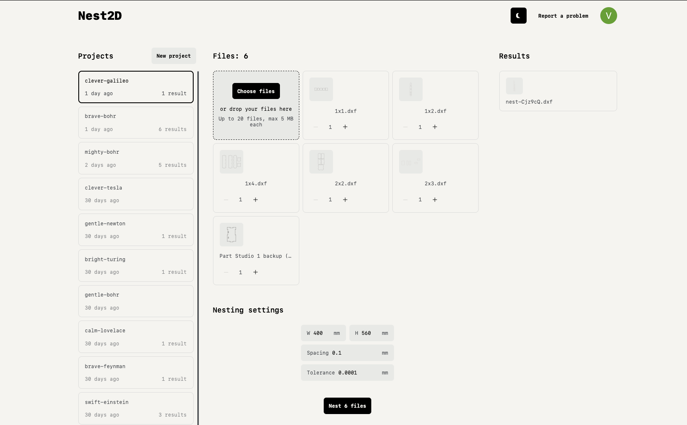

# APlasma Nesting

Nesting for plotters, laser & plasma cutters, and other CNC machines.
Inspired by [Nest2D](https://github.com/VovaStelmashchuk/nest2d) (fork).
Self-hosted on a homelab (Docker Compose + Nginx Proxy Manager).



---

## Table of contents

- [Architecture](#architecture)
- [Homelab deployment (Docker Compose)](#homelab-deployment-docker-compose)
- [Administration panel](#administration-panel)
- [Configuration (`.env`)](#configuration-env)
- [Authentication](#authentication)
- [Local development](#local-development)
- [Stripe payments](#stripe-payments)
- [Credits](#credits)

---

## Architecture

A **Nuxt 3 fullstack** application (frontend + API in the same process) built on top of:

- **MongoDB** — stores users, projects, and **all files (DXF/SVG/avatars) via GridFS**.
- **4 Python workers** that consume a queue in Mongo:
  - `user-file-processing-worker` — DXF validation/preparation (bins)
  - `nesting-worker` — nesting algorithm (bins), via the Rust `nest-engine` binary (separation/compaction optimizer built on jagua-rs + sparrow)
  - `strip-file-processing-worker` — DXF preparation (strip)
  - `strip-nesting-worker` — strip nesting, via the `spyrrow` library
- **Authentication**: Google OAuth (PKCE) **and/or** a local email/password account.
- **Payments**: Stripe (subscription + credits) — optional.
- **Email**: Resend (nesting-finished notifications, support messages) — optional.

The 6 containers (app + mongo + 4 workers) run on an internal Docker network; only the app is exposed (on localhost) behind your reverse proxy.

```
                    ┌─────────────────────────────────┐
  Internet ──HTTPS──▶ Nginx Proxy Manager (TLS)       │
                    └──────────────┬──────────────────┘
                                   │ http
                    ┌──────────────▼──────────────────┐
                    │  app (Nuxt)  127.0.0.1:7100     │
                    └──┬─────────────────────────┬────┘
                       │                         │
              ┌────────▼────────┐      ┌─────────▼──────────┐
              │   mongo:27017   │◀─────│  4 Python workers  │
              │  (data volume)  │      │  (file + nesting)  │
              └─────────────────┘      └────────────────────┘
```

---

## Homelab deployment (Docker Compose)

### Prerequisites

- Docker + Compose v2 plugin
- A reverse proxy (e.g. Nginx Proxy Manager) terminating TLS and forwarding to `http://<host>:7100`
- A domain (e.g. `https://nesting.aplasma.fr`)

### Steps

1. **Clone** this repository on the host:
   ```bash
   git clone https://github.com/guiguijke/nest2d.git
   cd nest2d
   ```

2. **Create `.env`** from the example and fill it in (see [Configuration](#configuration-env)):
   ```bash
   cp .env.example .env
   $EDITOR .env
   ```

3. **Pull the images** (built by GitHub Actions on every push to `main`):
   ```bash
   docker compose pull
   ```
   > Until the first CI build completes, you can build the app locally: edit `docker-compose.yml`, comment out the `image:` line of the `app` service and uncomment the two `build:` lines.

4. **Start**:
   ```bash
   docker compose up -d
   ```

5. In **Nginx Proxy Manager**, create a Proxy Host:
   - Domain: `nesting.aplasma.fr`
   - Forward Hostname/IP: the Docker host IP
   - Forward Port: `7100`
   - Enable SSL (Let's Encrypt) + force HTTPS

6. **Create your account** (via Google or email at `/auth/local`), then [make yourself an admin](#becoming-an-administrator).

### Updating

```bash
git pull
docker compose pull
docker compose up -d
```

---

## Administration panel

Administration is handled by a **separate application** living in [`./admin`](./admin/README.md): a Nuxt app with its own authentication (collection `admins`), exposed only on the local network. It shares the same MongoDB and provides user management, moderation (ban), credit adjustments, free-month grants (Stripe coupon or local grant), geo analytics, logs, support chat and payments overview.

Create the first admin account after starting the stack:

```bash
docker compose up -d admin
docker compose logs admin | grep -A12 "FIRST-TIME SETUP"   # grab the one-time token
```

Then open `http://localhost:7200/setup`, paste the token and fill in the credentials. The setup page locks itself once the first admin exists; afterwards everyone signs in at `/login`.

Then open the panel at `http://localhost:7200` (localhost-only by default; expose it via reverse-proxy/VPN only if you want remote access). Instant signup notifications and a periodic digest are sent to `NUXT_ADMIN_NOTIFY_EMAIL`.

> The main app no longer carries an admin role (`isAdmin`, the `/admin/support` page and the `scripts/promote-admin.js` helper have been removed) — all administration goes through the dedicated panel.

---

## Configuration (`.env`)

All configuration is driven by environment variables (see `.env.example` for the full list). The important ones are detailed below.

### Required

| Variable | Description |
|---|---|
| `NUXT_PUBLIC_BASE_URL` | Public URL (e.g. `https://nesting.aplasma.fr`). Used for OAuth redirects, SEO, email links. |
| `NUXT_MONGO_URI` | Keep the `docker-compose.yml` value (`mongodb://mongo:27017/nest2d`). **The DB name must be in the path.** |

> ⚠️ In `docker-compose.yml`, `NUXT_MONGO_URI` is **hardcoded** to `mongodb://mongo:27017/nest2d` for the internal network — only change it if you know why.

### Authentication

| Variable | Description |
|---|---|
| `NUXT_PUBLIC_LOCAL_AUTH_ENABLED` | `true` (default) to enable local email/password auth. |
| `NUXT_PUBLIC_GOOGLE_CLIENT_ID` | Google OAuth Client ID (see [Authentication](#authentication)). |
| `NUXT_GOOGLE_CLIENT_SECRET` | Google OAuth secret (Web App). |

### Optional

| Variable | Description |
|---|---|
| `NUXT_STRIPE_SECRET_KEY` | Stripe secret key (see [Payments](#stripe-payments)). |
| `NUXT_RESEND_TOKEN` / `NUXT_RESEND_FROM` | Transactional email (Resend). |
| `NUXT_PUBLIC_CLARITY_ID` | Microsoft Clarity ID (empty = disabled). |
| `NUXT_PUBLIC_SUPPORT_EMAIL` | Email shown in FAQ/Terms. |
| `NUXT_PUBLIC_GITHUB_REPO` | Your repo URL (footer, Terms). |
| `NUXT_BLOCKED_COUNTRIES` | ISO country codes to block (e.g. `RU,BY`). **Requires Cloudflare** (`cf-ipcountry` header). Without Cloudflare: no effect. |

---

## Authentication

Two modes, usable together or independently:

### Local account (email + password)

Enabled by default. Passwords are **hashed with bcrypt** (never stored in plaintext). Sign up / login page: `/auth/local`.

Password reset is implemented: `/auth/forgot-password` sends a reset link via Resend (valid 1 hour), and `/auth/reset-password` sets the new password. Resetting a password invalidates all existing sessions.

### Google OAuth (PKCE)

The project uses the **Authorization Code + PKCE** flow (the current standard recommended by Google — the legacy implicit `token` flow no longer works for recent apps).

**Configure in the [Google Cloud Console](https://console.cloud.google.com/apis/credentials)**:

1. Create an OAuth Client ID → type **Web application**.
2. Authorized redirect URI: `https://nesting.aplasma.fr/auth/google/callback` (adapt to your domain).
3. Copy the **Client ID** into `NUXT_PUBLIC_GOOGLE_CLIENT_ID` and the **Client Secret** into `NUXT_GOOGLE_CLIENT_SECRET`.

> For purely personal/private use, the local account is enough and removes any Google dependency.

---

## Local development

Prerequisites: Node 24+ (see `.nvmrc`) and an accessible MongoDB.

```bash
npm install

# Start Mongo (once)
docker run -d --name nest2d_mongo -p 27017:27017 -v "$(pwd)/.mongo-data":/data/db mongo:7

# Minimal env for dev
export NUXT_MONGO_URI=mongodb://localhost:27017/nest2d

# Start the dev server (http://localhost:3000)
npm run dev
```

The workers (file processing + nesting) are required to process files. In dev, you can run them via `docker-stack-external.yml` (once images are built) or directly in Python (see `workers/*/README.md`).

Production build:

```bash
npm run build
node .output/server/index.mjs
```

---

## Stripe payments

The code handles two models (selected by a feature flag `isStripFeatureEnable` on the user):

- **Subscription** (Strip nesting) — `subscription_plan` collection + Stripe Checkout subscription
- **Credits** (pay-as-you-go) — `products` collection + Stripe Checkout one-shot

### To wire your own Stripe account

1. Set `NUXT_STRIPE_SECRET_KEY` in `.env`.
2. Create your products/prices in Stripe, then **insert them into MongoDB**:
   - `products` collection: `{ stripePriceId, balance, title, description, prices: { usd: <cents> } }`
   - `subscription_plan` collection: `{ id: "subscription", priceId, prices: {...} }`
3. Update `server/features/payment/const.js` (`SUBSCRIPTION_PRODUCT_ID`) with your subscription product ID, or remove that constant if you have no subscription.

> ⚠️ **Stripe webhook**: the current code does **not** receive Stripe webhooks — it synchronizes payments via **polling** (plugins `4_stripesync`, `5_stripe_price_sync`, etc.). This works but is less reactive. If your payments were not updating, this is very likely the cause.

---

## Credits

This project builds on open-source work, in particular the [jagua-rs](https://github.com/JeroenGar/jagua-rs) collision-detection engine and the [sparrow](https://github.com/JeroenGar/sparrow) strip-packing heuristic by **[JeroenGar](https://github.com/JeroenGar)** (see `workers/nesting/engine/NOTICE`).

Other inspirations:
- [SVGNest](https://github.com/Jack000/SVGnest)
- [Deepnest](https://github.com/deepnest-next)
- [NEST4J fork](https://github.com/micycle1/Nest4J/tree/master)

### Referenced papers

- [López-Camacho _et al._ 2013](http://www.cs.stir.ac.uk/~goc/papers/EffectiveHueristic2DAOR2013.pdf)
- [Kendall 2000](http://www.graham-kendall.com/papers/k2001.pdf)
- [E.K. Burke _et al._ 2006](http://citeseerx.ist.psu.edu/viewdoc/download?doi=10.1.1.440.379&rep=rep1&type=pdf)

---

## Brand & fonts license note

The visual identity follows the APlasma brand guide (`CHARTE GRAPHIQUE AP.pdf`):
anthracite `#354046` / rust `#ab6715` on beige `#F5F0EB`, white/rust variants on
dark `#232C30`. Display typeface is **Helios Stencil** (titles, logo) with
**Montserrat** for body text.

⚠️ Helios Stencil is a **commercial typeface** (W Foundry). The bundled
`public/fonts/HeliosStencil/HeliosStencil-Bold.woff2/.woff` come from the
webfont package kept in `.zcode/font/` — make sure its license covers
web/production use, or replace it with a licensed alternative. Montserrat is
OFL and safe to ship.
