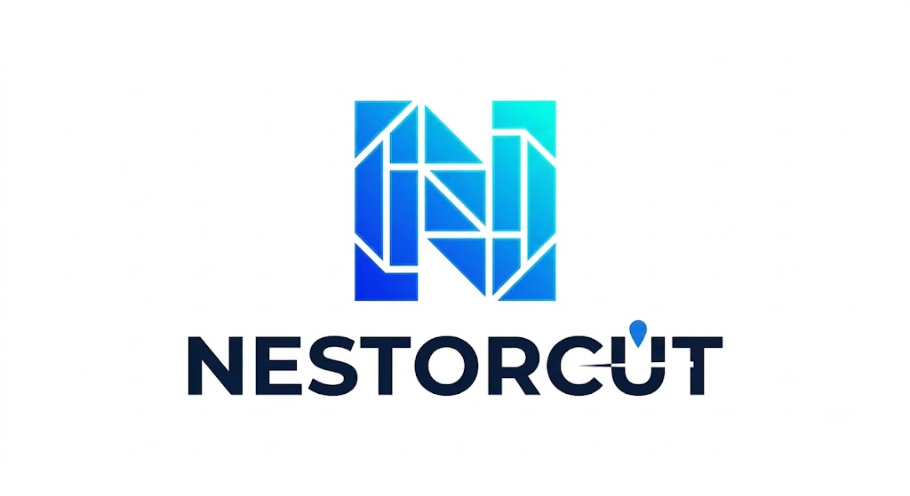

  <picture>
    <source media="(prefers-color-scheme: dark)" srcset="./public/brand/nestorcut-logo-dark-master.png">
    <source media="(prefers-color-scheme: light)" srcset="./public/brand/nestorcut-logo-light-master.png">
    
  </picture>

# NestorCut

Nesting for plotters, laser & plasma cutters, and other CNC machines.

NestorCut is a SaaS nesting platform: upload your DXF/SVG/DWG parts, get
optimized cutting layouts with a full material report — ready to cut in
seconds. The product lives at [nestorcut.com](https://nestorcut.com) (app:
[app.nestorcut.com](https://app.nestorcut.com)).

This repository is the source of that platform, published under the MIT
license. It is **not** a self-hosting kit: no deployment support is
provided — if you want to nest parts, use the hosted service.

## Features

- **True-shape nesting engine (Rust)** — separation/compaction with
  simulated annealing and multi-start parallelism (jagua-rs + sparrow)
- **DXF, SVG & DWG import** — content-signature detection, all conversions
  run in our own containers
- **Hole nesting** — small parts nested inside larger parts' cutouts
- **Canonical grid alternative** — for rectangular-part jobs: exact
  lattice + successive filled zones + analytic small-part tiling,
  deterministic, shown next to the engine layouts
- **Multi-sheet jobs & layout alternatives** — densest, largest remnant,
  balanced
- **Material report** — measured areas per sheet, reusable-offcut
  detection, CSV export
- **Zero-knowledge vault** — client-side AES-256-GCM encryption with a key
  file only you hold
- **Shared demo project** — try the engine without uploading anything
- **mm/inch units**, EN/FR interface

## Tech stack

Nuxt 4 (frontend + API) · MongoDB (GridFS) · Python workers · Rust nesting
engine. Internal architecture notes for contributors live in `AGENTS.md`.

## Credits

NestorCut started as a fork of [nest2d](https://github.com/VovaStelmashchuk/nest2d) by **Volodymyr Stelmashchuk** — thank you for open-sourcing it. The codebase has since been heavily extended and rewritten: Rust nesting engine (sparrow/jagua-rs), zero-knowledge vault, SVG/DWG import pipeline, material report, monetization, shared demo project.

Engine: [jagua-rs](https://github.com/JeroenGar/jagua-rs) and [sparrow](https://github.com/JeroenGar/sparrow) by **[JeroenGar](https://github.com/JeroenGar)** (see `workers/nesting/engine/NOTICE`).

Other inspirations:
- [SVGNest](https://github.com/Jack000/SVGnest)
- [Deepnest](https://github.com/deepnest-next)
- [NEST4J fork](https://github.com/micycle1/Nest4J/tree/master)

### Referenced papers

- [López-Camacho _et al._ 2013](http://www.cs.stir.ac.uk/~goc/papers/EffectiveHueristic2DAOR2013.pdf)
- [Kendall 2000](http://www.graham-kendall.com/papers/k2001.pdf)
- [E.K. Burke _et al._ 2006](http://citeseerx.ist.psu.edu/viewdoc/download?doi=10.1.1.440.379&rep=rep1&type=pdf)

## License

MIT — Copyright (c) 2025 Volodymyr Stelmashchuk (original
[nest2d](https://github.com/VovaStelmashchuk/nest2d) project) and
Copyright (c) 2026 Guillaume Jke — NestorCut (modifications and additions).
See [LICENSE](./LICENSE).
